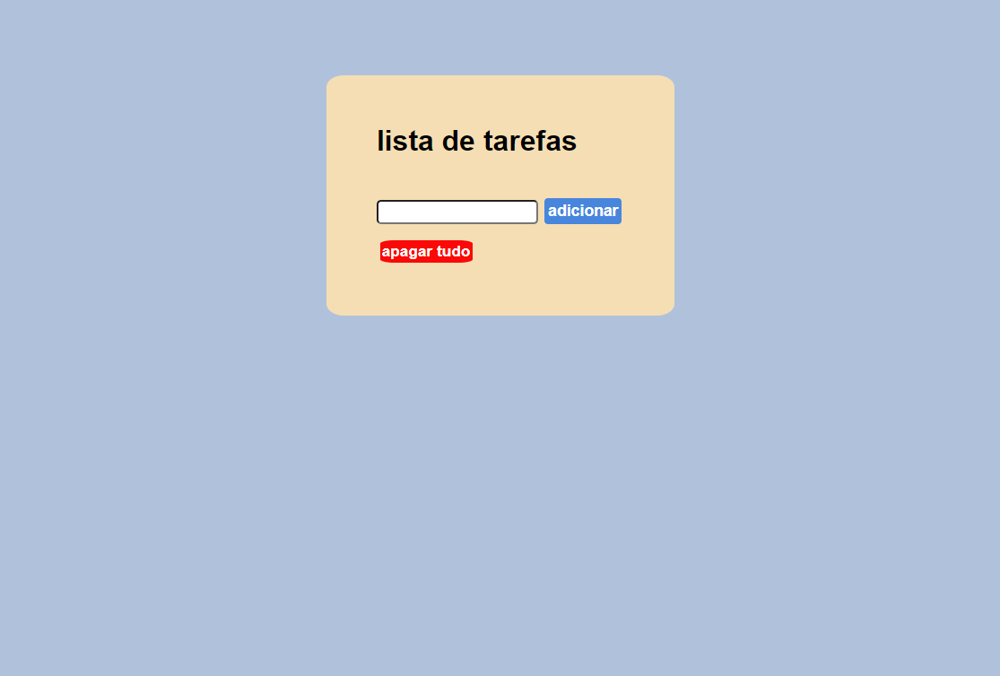

# lista de tarefas

<a href="https://vilmar-moreira-souza.github.io/listaTarefas/" target="blank">visualizar</a>
<h2></h2>

 
<h3>sobre a aplicação</h3>

essa aplicação cria uma lista de tarefas  e armazena na memoria do browser.   

<a href="https://vilmar-moreira-souza.github.io/listaTarefas/" target="blank">visualizar </a>

<h3>ideias para implementar</h3>

 <li>melhorar o design</li>
<li> adicionar detalhes da tarefa</li>
<li> possibilidade de editar a tarefa</li>
<li>deixar codigo javascript mais clean </li>
<li> mais...</li>

<h3>bugs e problemas</h3>

